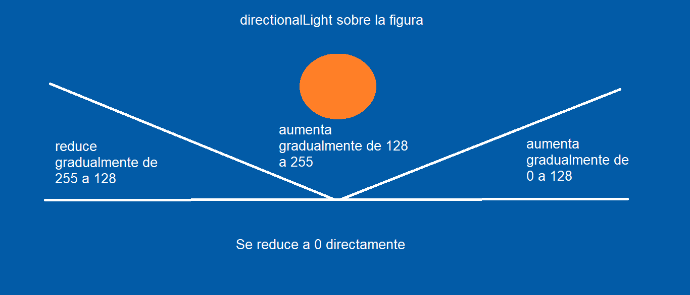

# Practica_5_Creando-Interfaces-de-Usuario
## Texturas e Iluminación - Ismael Aarab Umpiérrez

### Introducción
Para esta práctica de Creando Interfaces de Usuario, se va a trabajar en el uso de texturas e iluminación en las Figuras 3D, haciendole dar más realismo a las figuras.


### Desarrollo
- Principalmente se creó 2 esferas que representarán el cielo (día y noche), también se añadió un suelo dentro de estos para simular que se está en un campo.
- Posteriormente se crea 2 esferas mas pequeñas, que representarán el sol y la luna, donde estarán rotando constantemente, simulando como si fuera de día y de noche.
- Tras crear todo esto, se jugará con ellos para cuando salga el sol, se deje el cielo de dia, y cuando aparezca la luna, se deje el cielo de noche:
  - Con fill(r,g,b, ***opacity***) va a hacer que una de las esferas (exactamente la de día) pueda tener opacidad, así, que cuando se haga de noche, la haremos transparente.
- Modificamos la cámara para que solo tuviera movimiento dentro de la esfera, restringiendo libertad para que no saliera de esta.
- Una vez hecho esto, procedemos a crear las figuras y jugar con la luz:
  - La figura creada es de un personaje de animación japonesa llamado **Saitama** viniendo de la serie **One Punch Man**. Se ha tenido que hacer la figura casi al estilo **Lego** para poder añadir texturas correctamente. También se ha añadido unos monstruos que le va a atacar a las espaldas para adornar un poco más el entorno.
  ```
  Nota: Hay un tercer monstruo añadido, que es más grande, pero está comentado,
  ya que puede dar a ver que el tema principal (la luz de dia y de noche)
  no se vea reflejado, además de que tiene cambios bruscos de colores y puede marear bastante.
  Puede descomentarlo si lo quiere apreciar.
  ```
  - Para la luz se hace uso de **directionalLight()** para hacer que la luz que le da la figura esté acorde con el movimiento del sol o la luna. 
  - En ciertos momentos del día, va a tener más o menos intensidad de luz (por ejemplo: cuando amanece, tendrá poca intensidad, y a lo largo del día tendrá mas intensidad, hasta que anochece, que se le vuelve a reducir). 
  - Adjunto una imagen de como iría la intensidad de luz (siendo 0 el mínimo y 255 el máximo).
  
  - Cuando es de noche, la intensidad de la luz va a ser la misma en todo momento.
  
- Para que no se vea solo la luz del sol y la luna, cuando se hace de noche, haciendo **Click izquierdo** sobre el ratón, la figura se verá iluminada en **3 intensidades diferentes** (cada una con más intensidad que la otra, al hacer click por cuarta vez, se apaga la luz de la figura, haciendo un *reset*) con el uso de **pointLight()**. Si se deja una intensidad de luz puesta sobre la figura durante la noche, cuando vaya a amanecer, este se apagará automáticamente, ya que con la luz del sol se verá alumbrado.

### Instrucciones
  - **W y S** - Mueve la cámara.
  - **Flechas** - Rota la cámara.
  - **Barra espaciadora** - Resetea las coordenadas por defecto.
  - **Click izquierdo (Solo en modo noche)** - ilumina la figura con 3 intensidades diferentes (haciendo click lo varías).
  - **H** - Muesta/Oculta la ayuda.
  
  
### Herramientas y Referencias
  
  - [Conversión video a GIF](https://imagen.online-convert.com/es/convertir-a-gif)
  
  - [Textura Saitama (Cara)](https://steamcommunity.com/sharedfiles/filedetails/?id=880113839)
  
  - [Textura de monstruo](https://www.models-resource.com/wii/supersmashbrosbrawl/model/9029/)
  
